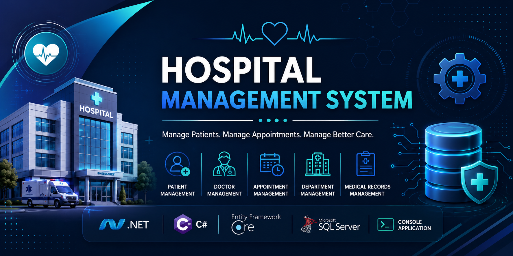

<p align="center">
  
</p>

# 🏥 Hospital Management System (HMS)


A **Hospital Management System** built as a **C# Console Application** using **Entity Framework Core** and **SQL Server** to manage hospital operations through a clean and interactive command-line interface.

---

# 📌 Overview

Hospital Management System (HMS) is a console-based application designed to simplify hospital management by organizing patients, doctors, departments, appointments, and medical records.

The project demonstrates **Object-Oriented Programming (OOP)**, **Entity Framework Core**, **LINQ**, **CRUD Operations**, **Data Validation**, and **SQL Server Integration** using a real-world healthcare scenario.

---

# 🚀 Features

- 👨‍⚕️ Doctor Management
- 🧑 Patient Management
- 📅 Appointment Management
- 🏥 Department Management
- 📋 Medical Record Management
- ➕ Create Records
- ✏️ Update Records
- ❌ Delete Records
- 🔍 Search Records
- 📄 View All Records
- 💾 SQL Server Integration
- ⚡ Entity Framework Core

---

# 📂 Project Structure

```text
Hospital-Management-System-HMS
│
├── Models
├── Data
├── Services
├── Migrations
├── Program.cs
└── HospitalDbContext.cs
```


# 🏗️ Architecture

The application follows a layered architecture where the Console UI communicates with the Service Layer, which interacts with Entity Framework Core to perform SQL Server database operations.

---

# 📋 Main Modules

| Module | Description |
|---------|-------------|
| Patients | Manage patient information |
| Doctors | Manage doctor records |
| Departments | Organize hospital departments |
| Appointments | Schedule and manage appointments |
| Medical Records | Store patient medical information |

---

# 📋 Main Operations

| Operation | Description |
|----------|-------------|
| Add | Create new records |
| View | Display existing records |
| Update | Modify stored information |
| Delete | Remove records |
| Search | Find specific records |
| Reports | Display available system information |

---

# 🔗 Database Relationships

- One Department → Many Doctors
- One Doctor → Many Appointments
- One Patient → Many Appointments
- One Patient → Many Medical Records

---

# 🎯 Highlights

- ✅ Console-Based User Interface
- ✅ Clean Project Structure
- ✅ Entity Framework Core
- ✅ SQL Server Database
- ✅ CRUD Operations
- ✅ LINQ Queries
- ✅ Database Relationships
- ✅ Input Validation

---

# 💡 Skills Demonstrated

- Object-Oriented Programming (OOP)
- Entity Framework Core
- LINQ
- CRUD Operations
- SQL Server
- Data Validation
- Console Application Development
- Relational Database Design

---

# 🛠️ Technologies

| Technology | Purpose |
|------------|---------|
| C# | Programming Language |
| .NET | Application Framework |
| Entity Framework Core | ORM |
| SQL Server | Database |
| LINQ | Data Querying |

---

# ⚙️ Getting Started

```bash
git clone https://github.com/Anoudalsaidi/Hospital-Management-System-HMS-.git

cd Hospital-Management-System-HMS-

dotnet restore

dotnet ef database update

dotnet run
```

---

# 📚 What I Learned

- Building a complete hospital management system
- Designing relational databases
- Implementing Entity Framework Core relationships
- Writing LINQ queries
- Performing CRUD operations
- Validating user input
- Working with SQL Server
- Applying Object-Oriented Programming principles

---

# 🚀 Future Improvements

- User Authentication
- Role-Based Authorization
- ASP.NET Core Web API
- Dashboard Version
- Docker Support
- Unit Testing
- Logging
- GitHub Actions (CI/CD)

---

# 👩‍💻 Author

**Anoud Alsaidi**

Backend Developer | .NET Developer | Entity Framework Core | SQL Server

- GitHub: https://github.com/Anoudalsaidi
- LinkedIn: https://www.linkedin.com/in/anoud-alsaidi

---

⭐ If you found this project helpful, consider giving it a Star.
